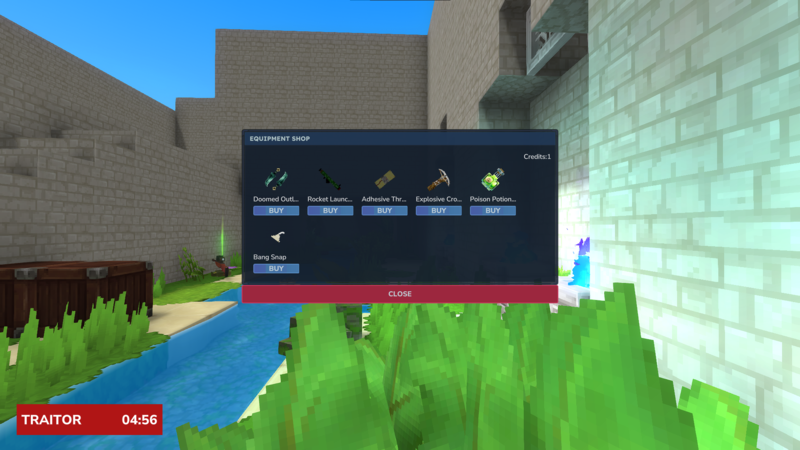
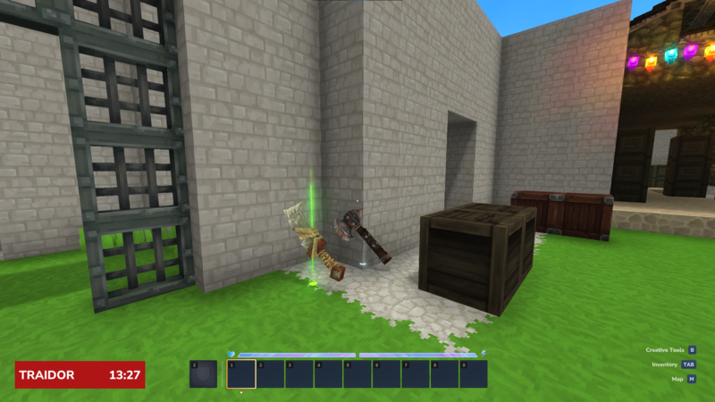
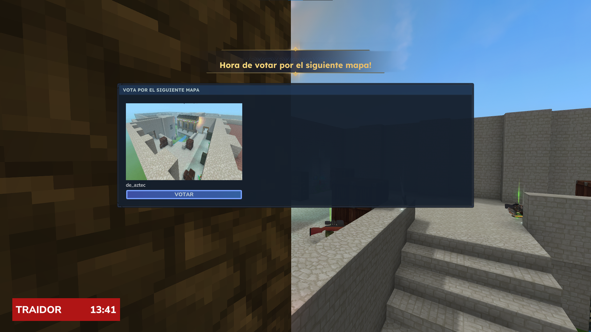
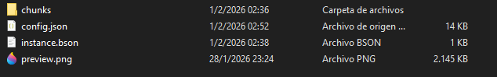
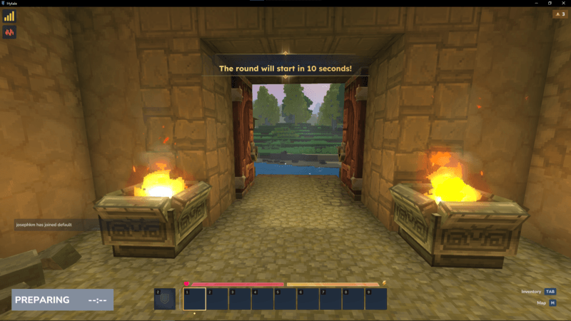
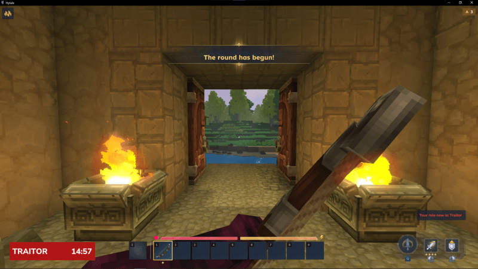
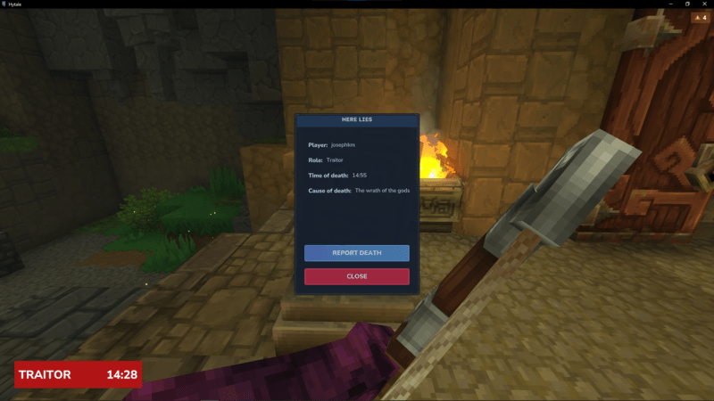
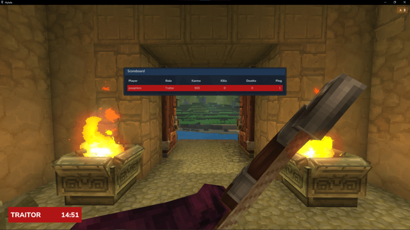

## Trouble in Trork Town (TTT) – Hytale Mod

**Trouble in Trork Town** is an open-source gamemode for **Hytale**, inspired by the classic _Trouble in Terrorist Town_
from Garry’s Mod.

Players are assigned hidden roles each round and must rely on deduction, investigation, and deception to survive.
Innocents attempt to uncover the truth, traitors sow chaos from the shadows, and detectives use special tools to piece
everything together—before it’s too late.

The project was prototyped during Hytale’s first week and is designed to be **modular, configurable, and extensible**,
making it easy for the community to build on top of it.

To set up this mod on a server please follow the guide at: [CONFIG.md](CONFIG.md#configuration)

***

## Current Features

### 🎭 Roles System

* **Innocent** – Work together to identify and eliminate traitors.
* **Traitor** – Secretly eliminate innocents and the detective.
* **Detective** – A special innocent role with investigative equipment.
* **Spectator** – Dead players can freely observe without interacting.
* Always-visible role UI for alive players.
* Role ratios are fully configurable.

> Planned: separate chat channels for alive and dead players.

***

### 🔫 Weapons & Equipment

* **Configurable equipment store** for traitors and detectives.
* Items can be purchased with credits or looted from dead players.
* Planned items:
    * Detective Skin
    * Heal Totem
    * DNA Scanner
    * Traitor Knife
* Weapon spawning integrated directly into maps.

***

### 🗺️ Custom Map System

- Templates folder inside universe are interpreted as instances of maps that can be voted and played.
- Player spawn positions are configurable.
- Weapons spawn positions are configurable.
- Amount of rounds per map configurable.
- Preview images of the map you are voting.

***

#### Weapon Spawning on Maps

* **Custom Weapon Spawn Points:** Define weapon spawn locations directly in map templates.
* **Weapon Categories & Ammunition:** Support weapon types (e.g. melee, ranged, utility) and associated ammo pools.

### 🔁 Round & Phase System

Rounds are event-driven and divided into clear phases:

1. **Waiting**

    1. Players spawn and explore freely.

    2. Round starts automatically when enough players join.

2. **Playing**

    1. Roles are assigned.

    2. Deaths affect win conditions and karma.

    3. Dead players become spectators.

3. **Aftermath**

    1. Cooldown before the next round.

    2. Ideal for map voting or short downtime.

Win conditions are evaluated dynamically as players die.

***

### ⚖️ Karma System

A configurable karma system that encourages fair play:

* Team kills reduce karma.
* Correct kills increase karma.
* All karma values are configurable.

Planned automatic punishments:

* Temporary bans when karma drops below a threshold.

***

### 🪦 Graves & Body Confirmation

* Dead players leave behind**graves**.
* Graves can be inspected to:
    * Confirm death
    * Reveal information about the victim
* Prevents instant role revelation and preserves deduction gameplay.

***

### 📊 Scoreboard

* Displays:
    * Kills / deaths
    * Karma
    * Role (revealed only after death)
* Traitor roles are hidden from alive players.

***

### 🌍 Localization

* Fully translation-ready.
* All text is externalized via language files.
* English and Spanish included by default.

***

## 🗺️ Backlog & Planned Features

This project is under active development. The short-term roadmap focuses on **core infrastructure** needed to support
richer gameplay and community-made content.

* Expanded detective and traitor equipment
* Separate chat channels (alive / dead / spectator)
* Karma-based punishments and reputation system
* Improved UI/UX polish
* Better modding hooks for third-party extensions

***

## Open-Source Philosophy

This mod is **fully open-source** and built with extensibility in mind.

* ECS-oriented design
* Contributions, maps, translations, and feature ideas are welcome

The goal is not just to recreate TTT, but to provide a **community-driven foundation** for gamemodes in Hytale.

***